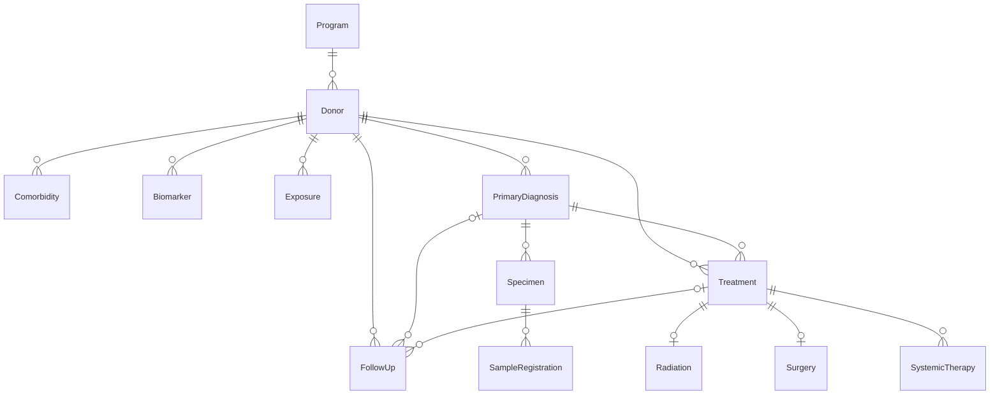

# CanDIGv2 Download Client

A command-line tool for exporting clinical, variant, and expression data from CanDIG servers.

## Overview

The CanDIG Download Client provides a way to download clinical, variant, and expression data from CanDIG federated networks. This tool allows users to:

- Connect to CanDIG servers with authentication
- Filter data types and donors to download

## Data types

### Clinical data

Clinical metadata is stored in CanDIG following the [MOHCCN Clinical Data Model](https://www.marathonofhopecancercentres.ca/researcher-hub/policies-and-guidelines). This tool will download clinical metadata as a set of up to 12 csv files saved into a directory named `clinical_data`, one for each schema in the data model. Each table can be joined using shared identifiers, these generally follow the pattern `submitter_<NAME_OF_SCHEMA>_id`. The `program_id` and `submitter_donor_id` appear in every table. Explicit links between schemas can be visualized as an ER diagram in the following dropdown: 

<details>

<summary>MOHCCN Clinical Data Model ER Diagram</summary>



</details>

### Experiment & analysis data

Experiment and analysis metadata are downloaded if Variant data is included in the overall download session. Experiment metadata is saved into a csv file called `experiment_data.csv` and contains information about how the sample was sequenced and provides a link to the `program_id` and `submitter_sample_id` in the clinical metadata. The analysis metadata contains information about how the raw data was analysed and informs a user which samples are contained in the file, and a link between the `submitter_sample_id` and the identifier used in the file to represent that sample. This file has one row per set of analysis file and index file, i.e. a vcf file and its linked tbi file would appear in one row. The file also contains all analysis files that matched the filtering query, whether they were downloaded or not. That is, if there are matching read (bam/cram) files that matched the query, their metadata will be added to this file, even though they won't be downloaded at this time. This serves to inform the user all the currently ingested analysis files for their query.  

### Variant data 

Variant data is downloaded as `vcf` and associated `tbi` index files. They are saved into a directory called `variant_data` with sub-directories for each program. `vcf` files typically contain variants from a single donor but two samples from a normal and a tumour specimen.

Variant data downloads are limited to files under 500mb currently. 

If your variant data download gets interrupted, please use the `--resume` argument (see `--help` for details). This argument will check the files for a specific directory and re-download any that did not complete downloading in a previous download session. If all files successfully downloaded, nothing will be downloaded.

### Transcriptomic data

Expression count data is downloaded as TSV files and saved into a directory called `expression_data` with sub-directories for each program.

Expression can be downloaded in two ways:

- **By program** (`--program-id`): fetches expression files for all samples in the specified program
- **By genomic region** (`--gene-id` or `--coord`): fetches expression files by biosamples

Expression downloads are subject to the same 500 MB per-file size limit as variant downloads.

### Read data

It is currently not possible to download read data using this client.

## Install

```bash
# Install UV if you don't have it yet
curl -LsSf https://astral.sh/uv/install.sh | sh

git clone https://github.com/CanDIG/candigv2-download-client.git
cd candigv2-download-client

# create virtual environment
uv venv
source .venv/bin/activate

# install dependencies
uv pip install -e .
```

## Configure CanDIG instance

Change the value of `DEFAULT_BASE_URL` to the CanDIG instance you will be downloading from in `src/client/config.py`.  This is the node and URL that you commonly log in to.
For example:
```bash
# MOH-Q
DEFAULT_BASE_URL = "https://candig.sd4h.ca"
# BCGSC
DEFAULT_BASE_URL = "https://candigv2.bcgsc.ca"
# UHN
DEFAULT_BASE_URL = "https://candig.uhnresearch.ca"
```

## Usage

The program can download clinical, variant, expression, or all data a user is authorized for using the following arguments: `--clinical`, `--variant`, `--expression`, or `--all`. The data downloaded can be further filtered using clinical and genomic parameters described in detail below.

```bash
candig-download [OUTPUT_TYPE] [FILTER]
```

## Authentication

- You can provide the token using the `--token YOUR_TOKEN` argument.
- If `--token` is not provided, the script will prompt you to enter the token securely in the terminal
- To get a token, go to the data portal for your CanDIG deployment, login, then open the user profile menu in the top right corner. Click the 'Get API Token' button and click the token text to copy it. The token lasts 30 minutes and should be kept secure and not shared.

## Options

**Arguments:**

- **Donor Filters:**
  - `--gene-id`: Filter to donors that have mutations in a particular gene (e.g., `SLX9`)
  - `--coord`: Filter to donors that have mutations in a particular genomic region (e.g., `chr1:10000-20000`)
  - `--treatment-type`: Filter to donors treated by one or more treatment types.
  - `--drug-name`: Filter to donors treated with one or more systemic therapy drugs.
  - `--primary-site`: Filter to donors with a tumour diagnosed in one or more primary sites.
  - `--program-id`: Filter to donors from one or more program IDs.
- **Output type:**
  - `--all|-a`: If specified, downloads all data types (clinical, variant, and expression)
  - `--clinical|-c`: If specified, downloads only clinical data
  - `--variant|-v`: If specified, downloads variant data; requires `--coord` or `--gene-id`
  - `--expression|-e`: If specified, downloads expression count TSV files; requires `--program-id`, `--gene-id`, or `--coord`
  - `--log-level|-ll`: set the logging level (10=DEBUG, 20=INFO, 30=WARNING, 40=ERROR, 50=CRITICAL). Default is INFO (20)
  - `--dry-run|-d`: If specified, shows what would be downloaded (record counts, file sizes). Note that variant dry-run downloads the clinical data for filtering purpose.
  - `--resume|-r` continue the download by locating the existing session folder

> [!Tip]
> Filters must be individually quoted strings.

> [!Note]
> If no filters/args are provided, the program will attempt to download *all* data available to user.

> [!CAUTION]
> Filters must match those indicated in the data portal exactly and are case-sensitive.

**Examples:**

1. **Fetch all available data types for all programs you have authorization for:**

    ```bash
    candig-download -a --token YOUR_TOKEN
    ```

2. **Fetch all available data for one program:**

    ```bash
    candig-download -a --program-id "MoHQ-CM-37" --token YOUR_TOKEN
    ```
   
    To specify multiple programs

    ```bash
    candig-download -a --program-id "MoHQ-CM-37" "POG" --token YOUR_TOKEN
    ```

3. **Fetch clinical data for donors with mutation in a gene ID with verbose logging:**

    ```bash
    candig-download -ll 10 -c --gene-id SLX9 --token YOUR_TOKEN
    
    ```

4. **Fetch variant data for donors with mutation in a gene ID in dry mode:**

    ```bash
    candig-download -d -v --gene-id SLX9 --token YOUR_TOKEN
    ```

5. **Fetch all available data for donors with mutation in a gene ID:**

    ```bash
    candig-download --gene-id SLX9 -a --token YOUR_TOKEN
    ```

6. **Fetch clinical and variant data where donors have mutations within the matching coordinates:**

    ```bash
    candig-download -c -v --coord "chr21:10522300-10530000" --token YOUR_TOKEN
    ```

7. **Fetch all available data for donors with primary site identified as either `Colon` or `Bronchus and Lung`:**

    ```bash
    candig-download -c --primary-site "Colon" "Bronchus and lung" --token YOUR_TOKEN
    ```

8. **Fetch all available data for donors that were treated with the drug `Durvalumab` (allowing for multiple case-sensitive options):**

    ```bash
    candig-download -a --drug-name "Durvalumab" "durvalumab" --token YOUR_TOKEN
    ```

9. **Download all variants for all donors from all authorized programs within the `SLX9` gene:**

     ```bash
     candig-download -v --gene-id SLX9 --token YOUR_TOKEN
     ```

10. **Fetch expression data for all samples in a program:**

    ```bash
    candig-download -e --program-id "MoHQ-CM-37" --token YOUR_TOKEN
    ```

11. **Fetch expression data for donors with a mutation in a gene:**

    ```bash
    candig-download -e --gene-id SLX9 --token YOUR_TOKEN
    ```

12. **Fetch expression data for donors with a mutation in a genomic region:**

    ```bash
    candig-download -e --coord "chr21:10522300-10530000" --token YOUR_TOKEN
    ```

13. **Resume download**

    ```bash
    candig-download -r candig_downloads/{session_id} --token YOUR_TOKEN
    ```

## Help

If you get stuck using the program or find a bug, please file a [Github issue](https://github.com/CanDIG/candigv2-download-client/issues/new/choose) on this repo.

## License

This project is licensed under GNU LESSER GENERAL PUBLIC LICENSE - see the [LICENSE](LICENSE) file for details.
